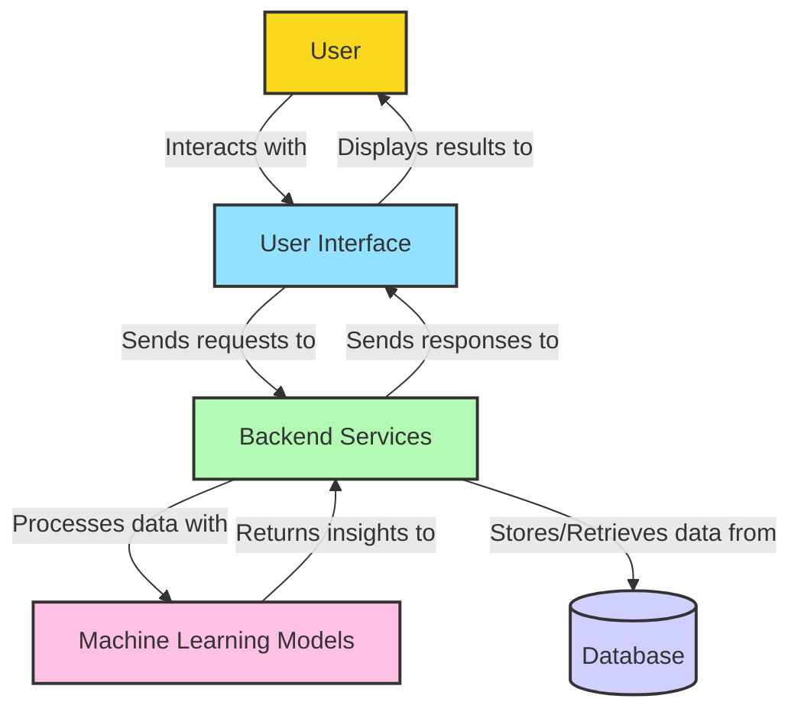
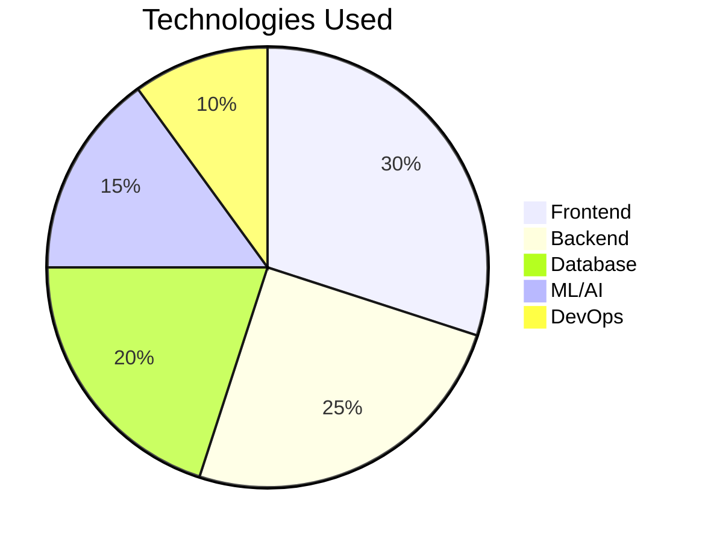
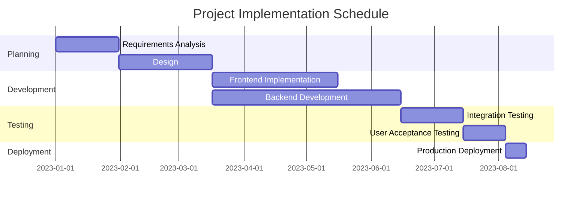

# YUNA Project Functions Overview

## Project Architecture Diagram

## Key Functions

| Function | Description |
|----------|-------------|
| **User Authentication** | Secure login and account management system |
| **Data Processing** | Handling and transformation of input data |
| **Analytics Engine** | Processing algorithms for insights generation |
| **Reporting Module** | Generation of comprehensive reports and visualizations |
| **API Integration** | Connections with external services and data sources |
| **Real-time Updates** | Live data streaming and instant notifications |

## System Flow

*Note: Replace the placeholder image above with an actual project flow diagram*

## Technology Stack

## Implementation Timeline

---

This document provides a visual representation of the YUNA project's architecture and functions. For detailed technical documentation, please refer to the project's code repositories and documentation.
